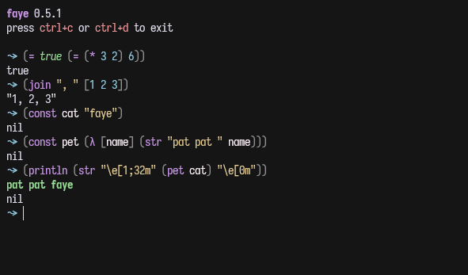

<div align="center">
<h1>faye</h1>


[](https://crates.io/crates/faye)
[](https://ci.codeberg.org/repos/12559)

faye is the name of coquettish tiny grey cat, the middle name of a pretty ombre girl in Missouri, and this lil lisp

[Website](https://faye.codeberg.page)


</div>

## Installation

```sh
cargo install faye
```

## Usage

Run the repl

```sh
faye
```

Evaluate an expression

```sh
faye -e '(* 3 2)'
```

Evaluate a file

```sh
faye main.fy
```

### Flags

- `-e`, `--eval`: Evaluate a string
- `-l`, `--lex`: Print the lexer output
- `-a`, `--ast`: Print the parser output
- `-m`, `--matching-brackets`: Highlight matching brackets

`faye -h` for more information.

## License

[Apache-2.0](LICENSE)