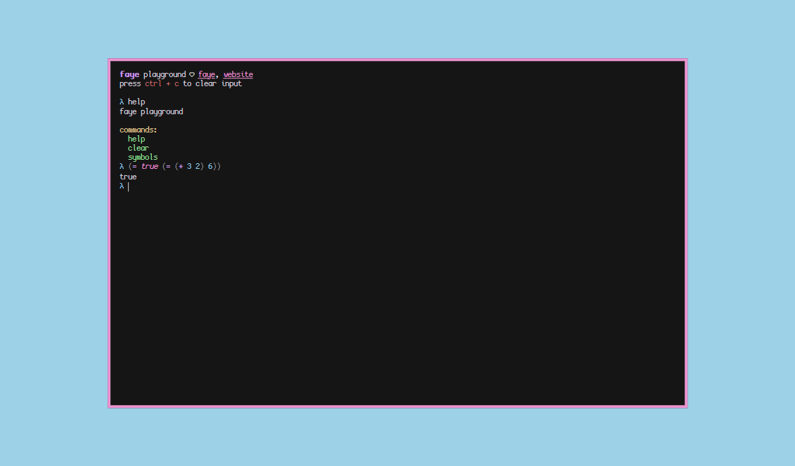

# faye-web

pretty playground for a pretty lisp 🦋

## License

- Source code is licensed under [Apache-2.0](LICENSE)
- [Cozette](https://github.com/slavfox/Cozette) (font used) is licensed under [MIT](https://github.com/slavfox/Cozette/blob/master/LICENSE)
- faye's logo by [fawn](https://x4.pm) and [rini](https://rinici.de) is licensed under [CC-BY-NC-SA-4.0](http://creativecommons.org/licenses/by-nc-sa/4.0/)
